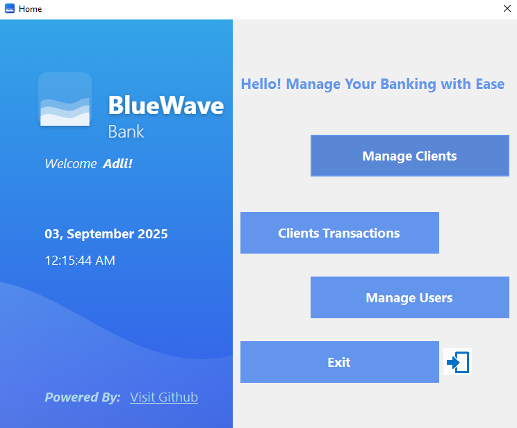

# 🌊 BlueWave Bank  

BlueWave Bank is a **C# Windows Forms project** that simulates a small banking system.  
It allows users to log in, manage clients, perform transactions, and manage other users with different permissions.  

---

## ✨ Main Features  
- Login & Logout system  
- Deposit, Withdraw, and Transfer money between accounts  
- View all clients and total balances  
- Manage clients (Add, Update, Delete)  
- Manage users with permissions (Admin, Normal user)  

---

## 🖼️ Screenshots  

### Login Screen  
  

### Dashboard  
  

### Transactions  
  

👉 More screenshots in the [`/screenshots`](./screenshots) folder.  

---

## ▶️ How to Run  
1. Clone or download the project.  
2. Open **`BlueWave Bank.sln`** in **Visual Studio**.  
3. Press **Run (F5)** to start the program.  

---

## 📚 Notes  
- Client and user data are stored in text files (`Clients.txt`, `Users.txt`).  
- Admin has full permissions (`-1`), while other users have limited permissions.  
